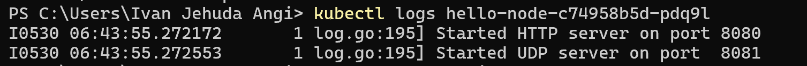
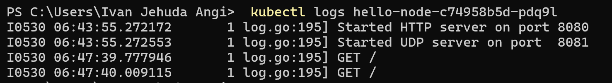
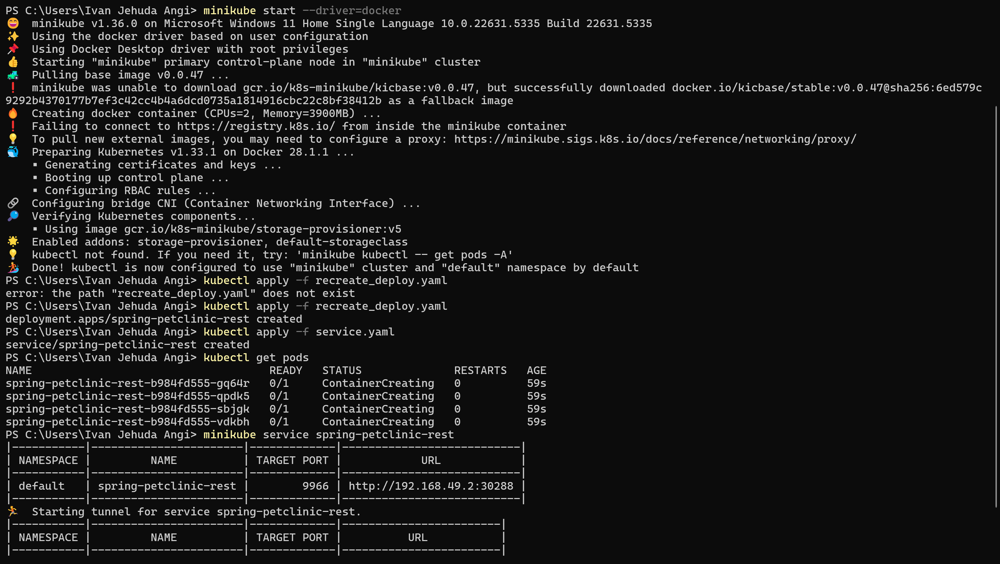

# Module 11 Reflection
Ivan Jehuda Angi - 2306152222 - Advance Programming A
## Tutorial: Hello Minikube
### Compare the application logs before and after you exposed it as a Service.Try to open the app several times while the proxy into the Service is running.What do you see in the logs? Does the number of logs increase each time you open the app?


* **Before Exposure:**

  * Prior to making the Pod accessible via a Service, I used the command `kubectl logs hello-node-c74958b5d-zcs8g` to view the logs. At that time, the logs only displayed the application's startup messages:

  * 

  * These entries confirmed the app was running, but there was no indication of any external traffic reaching it yet.

* **After Exposure:**

  * Once I exposed the Pod using `minikube service hello-node`, I accessed the application through a web browser multiple times. Each refresh in the browser triggered a new HTTP GET request routed through the Service. When I checked the logs again, I noticed new entries corresponding to these incoming requests.

  * 

  * This demonstrated that exposing the Pod via a Service enables external access, allowing clients like browsers to interact with the application—each request being captured in the container’s logs.

### What is the purpose of the `-n` option and why did the output not list the pods/services that youexplicitly created?


* During the tutorial, I ran two variations of the `kubectl get pods` command:

  * `kubectl get pods`
  * `kubectl get pods -n kube-system`

* The first command, without any flags, retrieves Pods from the **default namespace**, which is where user-created resources like the `hello-node` Pod and Service are deployed by default.

* The second command uses the `-n kube-system` flag to query the **kube-system** namespace. This namespace contains core Kubernetes components such as DNS services, kube-proxy, and the dashboard.

* When I executed `kubectl get pods -n kube-system`, the `hello-node` Pod didn’t appear because it was not deployed in that namespace. This experience helped clarify the role of namespaces in Kubernetes—they serve to isolate and organize different sets of resources, effectively acting as separate virtual clusters within the main Kubernetes environment. Understanding which namespace you're operating in is essential for managing cluster resources effectively.

## Tutorial :  Rolling Update & Kubernetes Manifest File
### What is the difference between Rolling Update and Recreate deployment strategy?


With a **RollingUpdate**, Kubernetes gradually replaces old Pods with new ones, ensuring the application stays available by keeping some old replicas running while the new ones start. If any of the new Pods fail to become healthy, the system can automatically roll back to the previous version. This method allows fine-tuning of how many Pods can be temporarily unavailable or exceed the desired count, providing near-zero downtime and a safety net in case of failure.

In contrast, the **Recreate** strategy stops all existing Pods before launching any new ones. Since there's no overlap between old and new Pods, this approach causes a short period of complete downtime. While simpler, Recreate is more suitable for scenarios where running multiple versions simultaneously isn't safe, such as during one-way database schema changes. Meanwhile, RollingUpdate is typically preferred for stateless services that require continuous availability during updates.

### Try deploying the Spring Petclinic REST using Recreate deployment strategy and document your attempt.
 

 ### Prepare different manifest files for executing Recreate deployment strategy.
 ```yaml
apiVersion: apps/v1
kind: Deployment
metadata:
  annotations:
    deployment.kubernetes.io/revision: "1"
  creationTimestamp: "2025-05-29T02:47:29Z"
  generation: 1
  labels:
    app: spring-petclinic-rest
  name: spring-petclinic-rest
  namespace: default
  resourceVersion: "1863"
  uid: 330c000b-6357-45a6-a1e7-0fdce399a0b8
spec:
  progressDeadlineSeconds: 600
  replicas: 4
  revisionHistoryLimit: 10
  selector:
    matchLabels:
      app: spring-petclinic-rest
  strategy:
    type: Recreate
  template:
    metadata:
      creationTimestamp: null
      labels:
        app: spring-petclinic-rest
    spec:
      containers:
      - image: docker.io/springcommunity/spring-petclinic-rest:3.0.2
        imagePullPolicy: IfNotPresent
        name: spring-petclinic-rest
        ports:
        - containerPort: 8080
          protocol: TCP
        resources: {}
        terminationMessagePath: /dev/termination-log
        terminationMessagePolicy: File
      dnsPolicy: ClusterFirst
      restartPolicy: Always
      schedulerName: default-scheduler
      securityContext: {}
      terminationGracePeriodSeconds: 30
status:
  availableReplicas: 4
  conditions:
  - lastTransitionTime: "2025-05-29T02:47:32Z"
    lastUpdateTime: "2025-05-29T02:47:32Z"
    message: Deployment has minimum availability.
    reason: MinimumReplicasAvailable
    status: "True"
    type: Available
  - lastTransitionTime: "2025-05-29T02:47:29Z"
    lastUpdateTime: "2025-05-29T02:47:32Z"
    message: ReplicaSet "spring-petclinic-rest-b984fd555" has successfully progressed.
    reason: NewReplicaSetAvailable
    status: "True"
    type: Progressing
  observedGeneration: 1
  readyReplicas: 4
  replicas: 4
  updatedReplicas: 4
```
### What do you think are the benefits of using Kubernetes manifest files?
When deploying manually, we have to enter many commands one after another, remember specific flags and image tags, and it’s easy to make errors or lose track of what was done. Using manifest files simplifies this process by storing everything — like replica counts, image names, ports, and update strategies — in easy-to-read YAML files. With a single `kubectl apply -f` command, Kubernetes ensures the cluster matches the configurations in those files. This approach ensures deployments are reliable and repeatable, allowing us to reuse the same files across different machines or after failures without memorizing commands. Storing manifests in Git also helps us monitor changes, collaborate with others, and revert to previous versions if needed.


